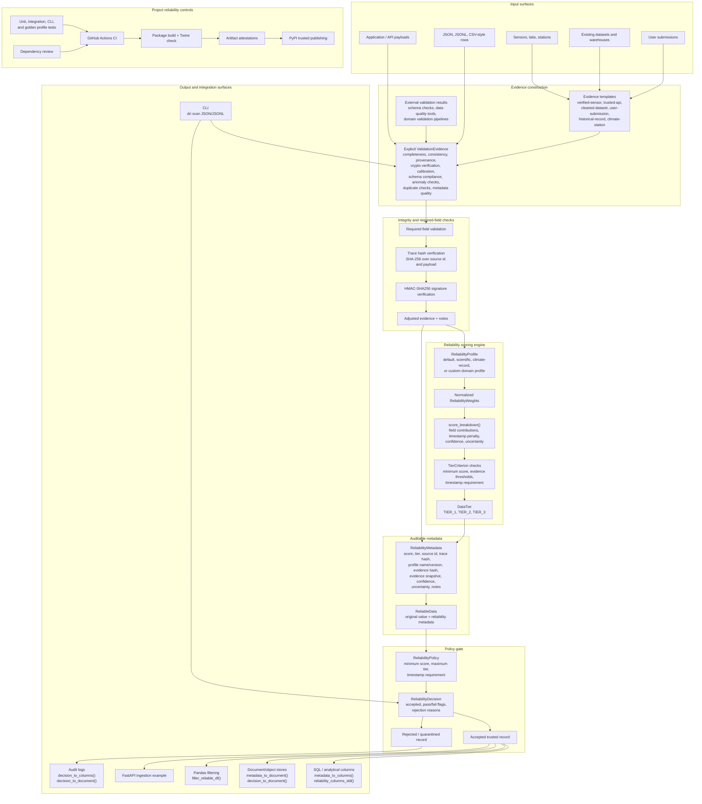

# Architecture

This diagram shows how Data Reliability Index turns raw records into auditable reliability decisions. The SDK keeps the core scoring path independent from database, API, Pandas, and CLI integrations so applications can adopt the index without changing their storage or ingestion stack.

## Implementation Layers

| Layer | Main modules | Responsibility |
| --- | --- | --- |
| Core models | `data_reliability.core` | Tiers, metadata, reliable payload wrapper, policies, and decisions. |
| Scoring | `data_reliability.scanner` | Evidence models, profiles, score calculation, tier assignment, trace hashes, HMAC verification, and score breakdowns. |
| Templates | `data_reliability.templates` | Conservative evidence defaults for common data source types. |
| Storage helpers | `data_reliability.database` | SQL/document metadata export, DDL generation, row scanning, and decision audit export. |
| Analysis integration | `data_reliability.pandas_ext` | DataFrame filtering by policy. |
| CLI | `data_reliability.cli` | JSON and JSONL record scanning from shell workflows. |
| Examples | `examples/` | FastAPI ingestion, quarantine handling, and external data-quality mapping. |
| Release controls | `.github/workflows/` | CI, dependency review, package publishing, and artifact attestations. |

## Trust Flow

1. Raw data enters through an application, file, data pipeline, API, or manual submission.
2. Evidence is created from a template, explicit validation checks, or external data-quality results.
3. Required fields, trace hashes, and optional HMAC signatures adjust the evidence and add audit notes.
4. The active profile converts evidence into a score, breakdown, confidence, uncertainty, and tier.
5. `ReliabilityPolicy` decides whether the record can enter trusted storage.
6. Accepted records keep metadata beside the value; rejected records keep policy reasons in quarantine or audit logs.
7. Package CI and release provenance controls protect the SDK supply chain that implements the index.
